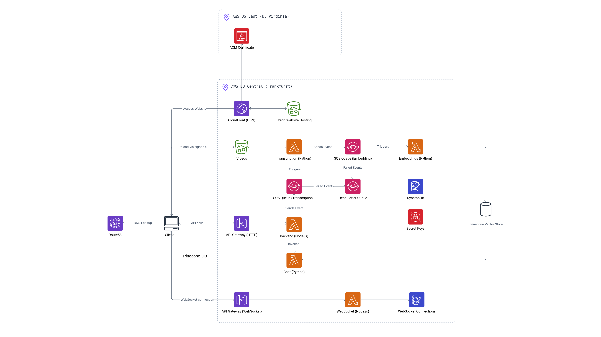

# Infrastructure Overview

This directory contains the Terraform code for provisioning the AWS infrastructure of the project. The architecture is modular and covers all major AWS resources required for a scalable, serverless application.

(Some components have been simplified for the sake of clarity.)

## Main Components

- **Frontend Hosting**: Static frontend is hosted on an S3 bucket, distributed via CloudFront, secured with ACM certificates, and managed DNS via Route53.
- **API Gateway**: Provides a GraphQL endpoint, integrated with a Lambda function.
- **Lambdas**: Four main Lambda functions (GraphQL, Chats, Embeddings, Transcription) for business logic and processing.
- **Queues (SQS)**: Decouples processing between services (Transcription, Embeddings, Chats).
- **Database**: DynamoDB table for persistent storage.
- **Storage**: S3 bucket for user data (e.g., videos).
- **Secrets**: AWS Secrets Manager for API keys (OpenAI, Pinecone, LangSmith).
- **Lambda Layers**: Shared code and binaries (LangChain, ffmpeg) for Lambdas.

## Modules
- `hosting/`: S3, CloudFront, ACM, Route53
- `api/`: API Gateway
- `lambdas/`: All Lambda functions
- `sqs/`: SQS Queues
- `database/`: DynamoDB
- `storage/`: S3 Data Bucket
- `secrets/`: Secrets Manager
- `layers/`: Lambda Layers

---

**How to use:**
1. Configure variables in each module as needed.
2. Run `terraform init` and `terraform apply` in this directory.